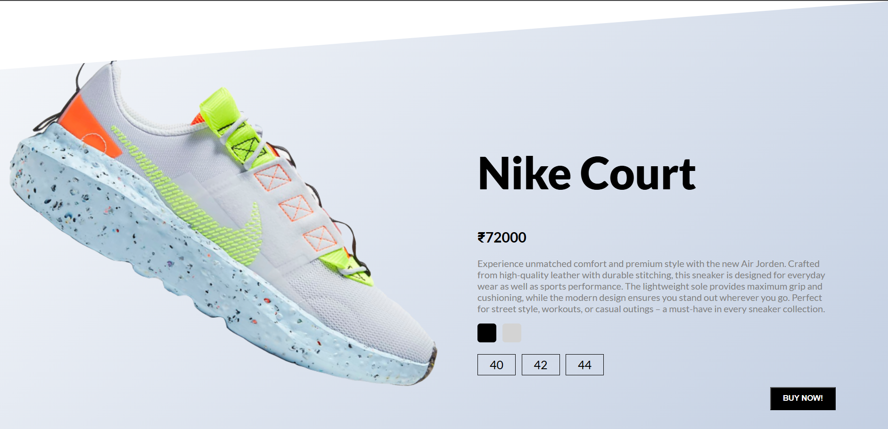
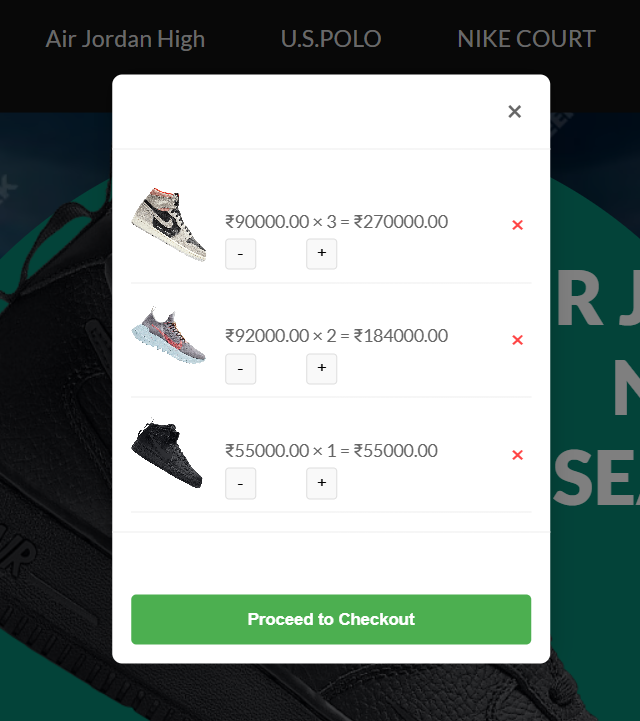

# 👟 Sneakers Website

A modern and stylish **Sneakers E-commerce Website** built using **HTML, CSS, and JavaScript**.  
This project showcases product display, add-to-cart functionality, and a responsive design.

---

## 🚀 Live Demo
🔗 [Click here to view the website](https://ketan-mali123.github.io/Sneakers-website/)

---

## 📸 Screenshots

### Home Page


### Product Page


### Cart Page


### Payment Page


---

## ✨ Features
- 🛒 Add-to-Cart with Quantity Adjustments  
- ✈️ Flying Shoe Animation on Purchase  
- 🔒 Payment Form Validation 
- 📱 Fully Responsive (Mobile → Desktop)  
- 💳 Buy Now / Payment modal  
- 🎨 Modern UI with gradient buttons & hover effects   
- 👟 Sneaker product slider with unique background colors  

---

## 🛠️ Technologies Used
- **HTML5** – Structure  
- **CSS3** – Styling, Flexbox, Animations, Gradients  
- **JavaScript (ES6)** – Functionality & Interactivity  
- **GitHub Pages** – Deployment  

---

## 📂 Project Structure
Sneakers-website/  
│── index.html  
│── style.css  
│── app.js  
│── images/  
│── Screenshots/  
│── README.md  

---

## ⚡ Getting Started
Clone the repo and open `index.html` in your browser:

```bash
git clone https://github.com/KETAN-MALI123/Sneakers-website.git


🤝 Contributing

Contributions, issues, and feature requests are welcome!


📧 Contact

Made with ❤️ by Ketan Mali

GitHub: KETAN-MALI123

Email: ketanmali12345@gmail.com